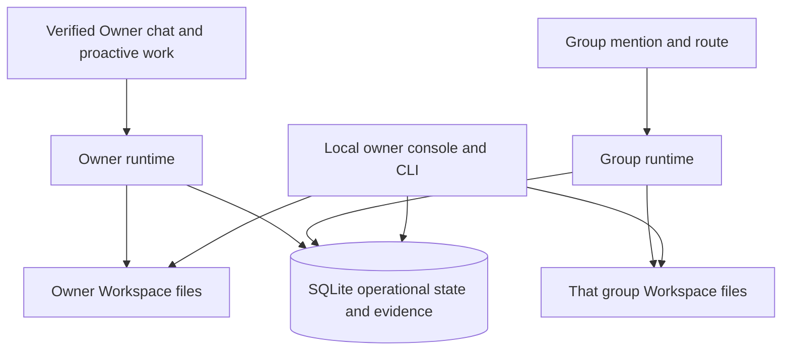

# memgov architecture: Personal Jarvis and Agent Workspaces

Status: current product architecture and approved storage boundary. Source, installation and live-platform validation are separated in [implementation status](../implementation-status.md). See the [details](architecture-detail.md) for module responsibilities and invariants.

## Responsibilities

memgov receives work through communication adapters, executes it through an Agent harness, and keeps durable knowledge in user-controlled workspaces. Owner private chat and proactive processing use the verified Owner's workspace; each group uses its own. Presets, transient task files, code worktrees and knowledge files have distinct lifecycles.

| Layer | Responsibility |
| --- | --- |
| Platform adapters | Message intake, identity, conversation, attachments, routing and delivery |
| Agent runtime | Context, bounded execution, tools, confirmation, cancellation and recovery |
| Agent Workspace | Preferences, project context, decisions and reusable procedures in Markdown files |
| SQLite state | Messages, internal Source evidence, task/attempt records, permissions, delivery and operation metadata |
| Local operations | Configuration, managed service, CLI, read-only knowledge browsing and task diagnostics |

## Knowledge and evidence

Files are authoritative for knowledge. The short index is refreshed every turn, while topic notes are searched and read when relevant. Agents maintain their files directly and preserve dates and source references. SQLite remains authoritative for execution facts and raw message evidence; a completed task or a retained source does not automatically become a note.

An explicitly configured Owner or group Agent may read Dokki or Confluence through memgov's own read-only source tools. Credentials stay in the private memgov home. Those documents remain external evidence; reading them does not import them into a Workspace. A group Agent can cite source content to its group only when its selected Agent declaration grants access. The [runtime design](../design/agent-runtime-design.md) defines this tool access.

The old Source → Candidate → Review → Memory knowledge pipeline, memory card UI and `memgov-memory` skill are replaced by [Agent Workspace](../design/agent-workspace-design.md). Internal Source and fragment records remain for message evidence and retention. Upgrades archive old knowledge and start clean workspaces rather than importing it.

## Identity and authority

Workspace identity is derived from verified ownership or the channel/conversation pair. Sharing an Agent preset does not share knowledge. Shared references require explicit read-only directory configuration. Knowledge, source text and tool output cannot change tool, execution or disclosure permissions.

Workspace tools enforce task and audience boundaries independently of prompt instructions. A directory name is not an OS sandbox: full Bash retains the service account's permissions. Existing confirmation and unknown-result recovery rules remain separate from knowledge writes.

The runtime implementation refreshes task-local tools and filtered skills for each attempt while preserving durable knowledge. A Claude Agent configured for full execution receives shell and web tools, with native file tools following its declared capabilities; restricted group Agents keep controlled Workspace access. See [runtime initialization](../design/agent-runtime-design-detail.md#executable-claude-initialization).

## Current behavior and future goals

Owner chat and group replies keep their configured routes. Proactive completion currently uses `record_only`; independently authorized communication is a separate operation. Personal root/child task graphs, complete environment snapshots and automatic proactive result notifications remain product goals requiring implementation and acceptance.

Group execution identifies the addressed requester separately from shared group history. Different members can run independent tasks within the configured group-runtime capacity; one member's follow-ups remain ordered, with separate task artifacts and replies. Sharing a group Workspace does not merge active tasks. The [runtime contract](../design/agent-runtime-design-detail.md#group-requesters-and-concurrency) defines the context and scheduling limits.

CLI and the local console inspect the same operational state and workspace files. Closing the console does not stop the service. Builds, installed executables, running processes and platform receipts require separate evidence. Future work follows the [best-practice scenarios](best-practice-scenarios.md), with delivery judged by useful outcomes and correct boundaries.
