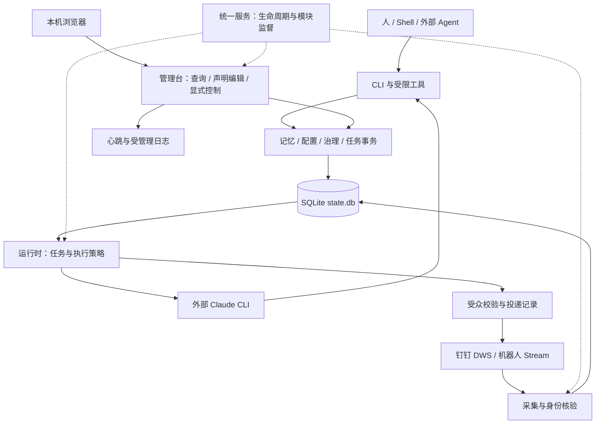

# memgov v2 总体架构

状态：按 2026-09-16 已提交源码核对的架构概览。具体实现、验证与安装状态见[能力状态](../implementation-status.md)，数据约束见[详细稿](architecture-detail.md)。产品目标以[最佳落地场景](best-practice-scenarios.md)为准。

## 职责与入口

记忆核心负责可信保存与治理；可选运行时把已授权的消息交给外部 Agent；统一服务管理这些模块的生命周期。2026-09-17 增加 macOS 当前用户 launchd 托管，负责登录启动、进程退出恢复和程序替换后的自动重启。本地管理台复用同一套业务和数据，不另建任务系统。

本地 Web 源码位于 `web/`，采用 React、TypeScript 和 Vite；卡片展示复用 relayer-next 的设计。前端构建成静态资源内嵌到 Go 二进制，用户运行时无需 Node，具体边界见[管理台设计](../design/local-console-design.md)。

Cyber 后台分析与任务执行由两个独立、有界的工作池推进，共享额度与执行租约保存在 SQLite；超时与版本变更阻止旧结果提交。进程心跳、采集覆盖、分析延迟和业务阻塞分别显示，不以“在线”代替整体健康，阶段范围见[运行时设计](../design/agent-runtime-design.md#cyber-并发与可靠性2026-09-18)。

记忆审查独立持久化排队、复用执行池且普通任务优先；业务结果与记忆沉淀分别保存。破坏性操作的具体提案与确认绑定任务版本；完整 Bash 下系统提示不是强制沙箱，租约和确认控制也不能被描述为操作系统隔离。

后台观察通过独立 Agent 处理后仅记录结果，不进入交互投递路径，也不向主 Agent 汇报。Agent 自主沟通通过独立可审计工具执行；Owner 私聊与群 @ 继续回复触发会话。身份、权限及迁移见[接入设计](../design/dingtalk-integration-design.md)。来源文字不能改变授权。

所有模型入口使用集中维护的 [sysprompt](../design/agent-runtime-design.md#统一系统提示与安全规则)，统一注入攻击与破坏行为的处理规则；恢复历史和热词保留在用户数据层。提示随二进制更新，权限门禁仍由运行时执行。

## 正式模型

Source 保存工作材料和证据，Candidate 表达新建或修订建议，Review 记录核对，Memory 保存可复用结论。正式记忆通过版本与操作记录修订。原始来源、临时任务进度与长期记忆分别治理，不能把发送成功或短期状态当作已验收经验。

SQLite `state.db` 是唯一真相源。YAML 是待应用的配置声明，已应用配置进入 SQLite；FTS、服务心跳和运行日志不是独立权威数据。Claude 原生会话文件保存临时执行上下文，数据库保存恢复关系与审计；文件缺失时不保证原生继续。

## 事务与历史

核心写操作统一检查证据、作用域、期望版本、幂等与审计。候选应用、合并和敏感清除绑定预览摘要；数据库由显式 init 升级，已安装的系统托管服务可在启动前备份并自动迁移受支持的旧版本。证据到期、撤回或权限变化须同步约束执行、查询和披露；具体规则见[架构详细稿](architecture-detail.md)与[治理指南](../guides/governance.md)。

## 检索

FTS 是可重建索引，正式数据不能靠 `index rebuild` 恢复。查询先应用工作区、生命周期与时间限制；群 Agent 另受当前受众披露规则约束。检索取舍见[定位](positioning.md#检索定位)，实现见[详细稿](architecture-detail.md#检索)。

## 演进边界

- 所有者私聊、群 @ 和主动观察保留各自身份、上下文与动作授权；统一进程不扩大权限。本人私聊和有效群 @ 在消息短事务提交后立即唤醒 Agent、不走 Haiku，并共用原消息“已收到 → 处理中 → 已完成／打叉”状态链；阶段表情有序旁路发送，不阻塞 Agent，等待审批保持“处理中”。阶段记录写入 SQLite 并在启动时补齐，原消息只保留当前标记，管理台可核对完整历史。群任务失败或操作结果未知时，只要已有可用结论，结论与异常状态仍幂等回复原群，阶段标记不替代正文反馈。群任务的回答与操作详情都留在原群，回复 @ 发起人，审批卡片 @ DWS 所有者并仅允许其同意或拒绝；不额外私聊。
- 统一服务提供模块监督；管理台提供可观察性及明确的控制入口。独立 `ui` 不重启服务或继续任务，Desktop 仍是后续范围。
- 模型能力由外部 Claude CLI 提供，memgov 负责流程与治理；不引入旧版通用 Skill 执行框架或第二套持久存储。
- 后续优先打通可验收的业务闭环，实施依赖见[路线](../roadmap.md)；[旧版决策](../archive/decisions/README.md)只解释历史。
