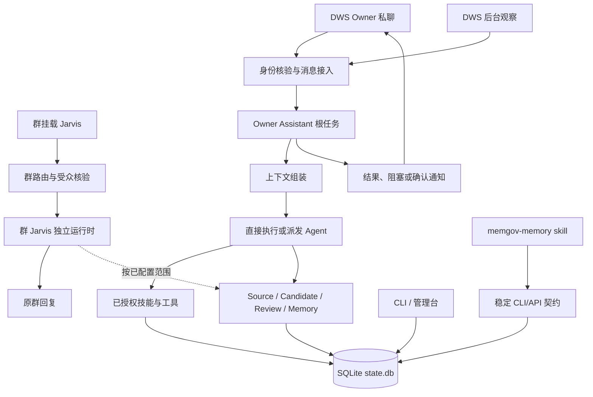

# memgov 总体架构：Owner Assistant 与记忆治理底座

状态：产品主线重构设计。本文定义 Owner Assistant 的职责、入口和边界；源码、安装版本和真实平台结果见[能力状态](../implementation-status.md)，实现约束见[详细稿](architecture-detail.md)。

## 核心职责

memgov 由四层组成：

1. **接入层**接收已核验的 Owner 私聊、DWS 观察消息和群 Jarvis 消息，并保留各入口的身份、会话和受众边界。
2. **Owner Assistant 层**把一个 Owner 请求或后台发现的事项组织为根任务，直接处理或派发有界 Agent，汇总结果并决定是否通知 Owner。
3. **记忆与证据层**用 Source、Candidate、Review、Memory 管理原始材料、临时判断和可复用知识。
4. **治理与运行层**控制配置、权限、工具调用、确认、恢复、投递和审计。

CLI、管理台和 `memgov-memory` skill 都是接入这些能力的方式，不各自建立第二套任务或存储系统。

## 入口与隔离

Owner 私聊是日常交办入口；DWS 主动值守发现属于 Owner 的事项后创建同一类根任务。两者可以共享受治理上下文，但仍记录不同的来源、触发原因和授权策略。后台任务的结果、阻塞和确认请求按当前通知策略回到 Owner；历史 `record_only` 任务继续兼容。

群挂载的 Jarvis 是并行运行面。它继续使用自己的机器人、群路由、preset、模型、技能、工具、共享记忆和回复方式，现有能力不因 Owner Assistant 重构而停用或削减。群 Jarvis 不自动继承 Owner 私聊历史、本人身份或 Owner 私有授权；Owner 在群里发言也不会把群消息改造成 Owner 私聊任务。未来若要增加群侧限制，应作为独立策略版本设计、迁移和验收。

统一进程只负责生命周期和共享数据库访问，不把不同入口合并成一个无边界的 Agent。来源正文、引用消息和记忆内容都是资料，不能自行改变授权、受众或发送身份。

## Owner Assistant 任务闭环

每个根任务至少能关联当前消息或 DWS 观察、上下文快照、子 Agent、工具动作、证据、结果和通知状态。简单问题可以由根 Agent直接回答；复杂事项按职责派发 `owner-executor`、`researcher`、`verifier` 或 `communicator`，最后由根任务汇总。

统一上下文顺序为：当前消息和引用、Owner 私聊历史、DWS 观察、任务进度、本机与项目环境、memgov 记忆和证据、已配置 skill 与工具。历史缺口、来源撤回和权限变化必须显式传给 Agent，不得将空结果解释为“没有发生过”。

自动执行覆盖 Owner 已委托的读取、代码修改、测试、构建、记忆治理和已配置工具。删除、停服、生产变更、跨受众披露、对外发送、权限扩大和未知外部结果重放需要当前 Owner 确认。权限版本变化会使旧任务或确认失效。

## 记忆模型与外部 Agent

SQLite `state.db` 是唯一真相源。Source 保存证据，Candidate 保存建议，Review 保存复核，Memory 保存应用后的可复用结论及版本；任务进度和外部投递记录不冒充 Memory。

`memgov-memory` skill 通过稳定契约向任何获准的 Agent 提供查询、候选、复核、应用、修订、退休、恢复、证据和操作历史能力。Skill 只授予 memgov 数据治理能力，不自动授予本机 shell、DWS 发消息、云平台或生产权限；宿主 Agent 的 capability 配置仍是最终边界。群 Jarvis 也可以在自身配置允许时接入 skill，接入本身不会改变它的群受众规则。

## 服务与观察

统一服务负责数据源、Owner Assistant、群 Jarvis、通知和管理台的生命周期；管理台查询同一数据库并提供明确的配置与任务控制。心跳、日志和 FTS 是派生观察数据，不能替代业务真相。运行、安装和真实平台验收分开记录，设计文档不等同于已交付能力。

后续实施和验收以[最佳落地场景与对齐标准](best-practice-scenarios.md)为准，详细任务、状态、接口、错误和测试约束见[架构详细稿](architecture-detail.md)及[Owner Assistant 设计](../design/owner-assistant-design.md)。
